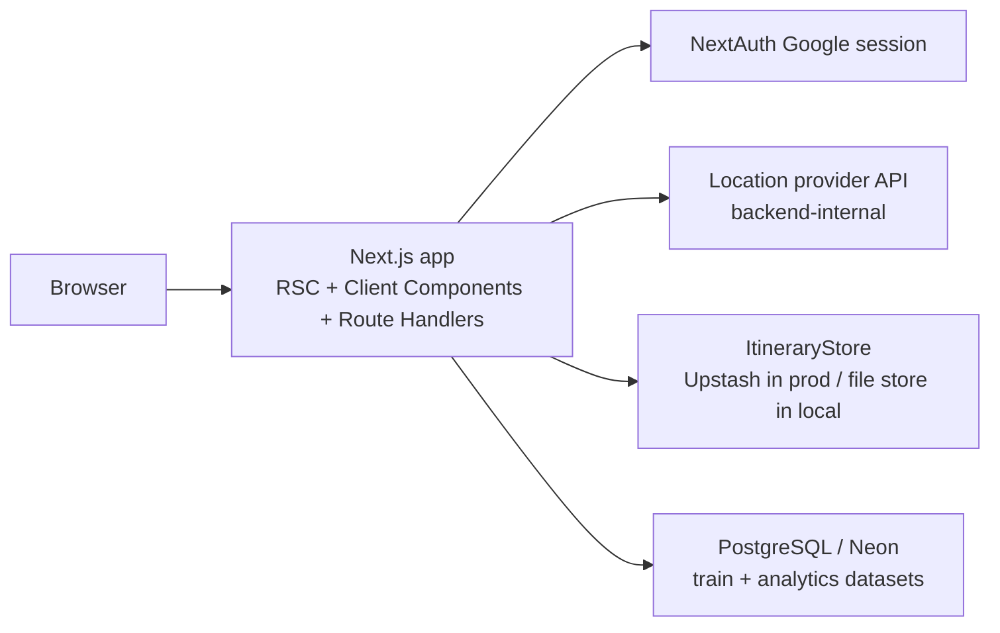
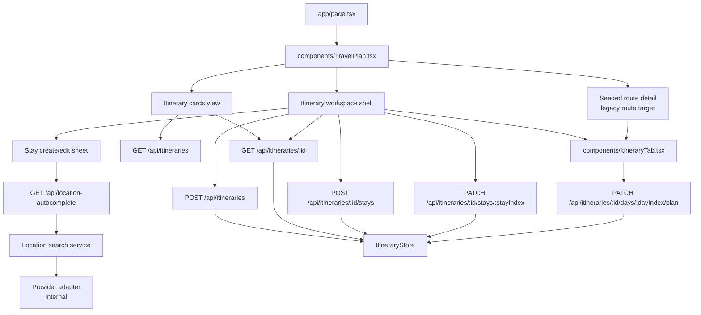

# System Architecture - travel-plan-web-next

## System Shape

Next.js 15 App Router remains the only deployable app. UI, authenticated APIs, location-provider integration, and storage access stay inside the same Vercel-hosted monolith.

## MVP Architecture Decisions

- Keep the existing itinerary editor as the primary workspace; do not add a separate planner app.
- Make the authenticated `Itinerary` tab a two-step flow: cards library first, existing editor second.
- Introduce an itinerary-scoped persistence boundary instead of the current single seeded `route` record.
- Keep the legacy seeded `route` available as a separate starter card inside the cards library instead of migrating it into user-owned itinerary storage.
- Store each itinerary as metadata plus `RouteDay[]` so `ItineraryTab` can keep its current rendering and plan-edit behavior.
- Add itinerary-scoped route handlers under `/api/itineraries*`; legacy flat write routes can be retained only as migration shims.
- Keep deployment, auth provider, logging stack, and serverless model unchanged.
- Keep third-party location lookup behind a backend-owned same-origin API so the frontend stays provider-agnostic.

## Component Boundaries

## Storage Model

- `itinerary metadata`: `id`, `ownerEmail`, `name`, `startDate`, `status`, `createdAt`, `updatedAt`
- `itinerary days`: full `RouteDay[]` blob keyed by `itineraryId`
- `user itinerary index`: ordered list of itinerary ids per owner for latest-itinerary lookup
- `stays`: derived from contiguous `RouteDay.overnight` blocks; no separate stay table in MVP

## Navigation Model

- `/` stays the main authenticated entry.
- `?tab=itinerary` opens the itinerary cards view for authenticated users.
- `?tab=itinerary&itineraryId=<id>` opens the existing itinerary workspace for the selected itinerary.
- `?tab=itinerary&legacyTabKey=route` opens the original seeded route inside the same detail shell.
- If `itineraryId` is absent, the app stays in cards view; if none exist, cards view renders the empty library state with `New itinerary`.
- The cards view may include one synthetic starter card backed by the legacy `route` store plus the user's persisted itineraries.
- `New itinerary` opens a lightweight create modal and redirects into the new workspace after success.

## Operational Baseline

- AuthN/AuthZ: existing NextAuth session; every itinerary API checks ownership by `ownerEmail`.
- Legacy seeded-route access stays inside the authenticated monolith and does not change user-itinerary ownership rules.
- Logging: structured `info/warn/error` logs with `itineraryId`, route name, user email, and validation code.
- Metrics: request count, p95 latency, create success rate, stay mutation failure rate.
- Third-party lookup: backend-owned location autocomplete exposed as `GET /api/location-autocomplete`; frontend adds debounce, request cancellation, max 5 results, and custom-location fallback on any failure.
- Security: keep provider credentials server-side; frontend never receives provider usernames, keys, or provider-specific query parameters.
- Backward compatibility: current editor data shape stays `RouteDay[]`; FE/BE migrate to itinerary-scoped APIs before removing legacy single-route flows.
